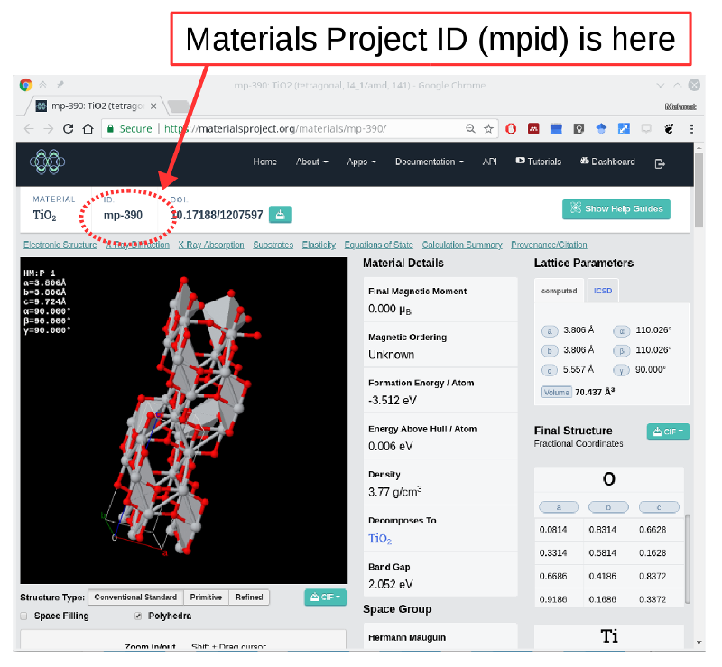

# t4iss
Implementation of some theoretical methods for ISS at NSLS-II.

    # Assuming you have python 3.6+ environment through anaconda 
    $ conda install --channel matsci pymatgen
    $ conda install -c omnia pybtex 
    $ cd data; unzip XANES.zip; cd ..
    $ jupyter notebook &

## module-1
This module gets structure from Materials Project based on mpid and generates 
a plot of coordination number around central atom and x-ray absorption spectrum
for each non-equivalent atomic sites.

## Author
* Mehmet Topsakal (mtopsakal@bnl.gov)
