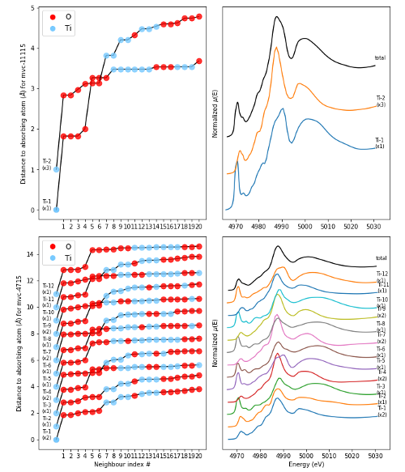
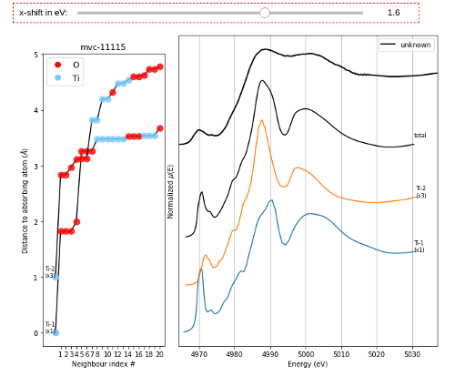
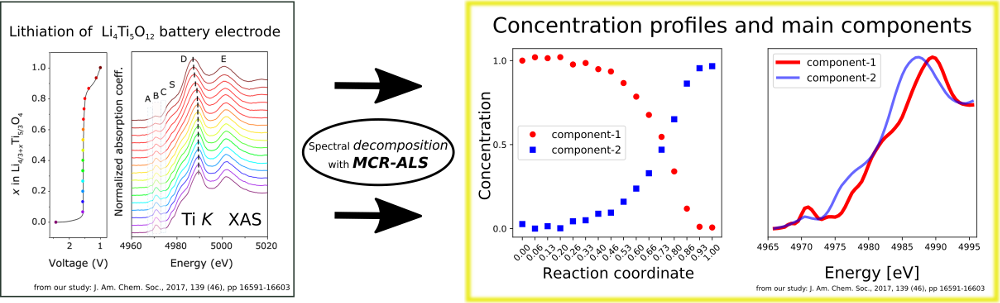
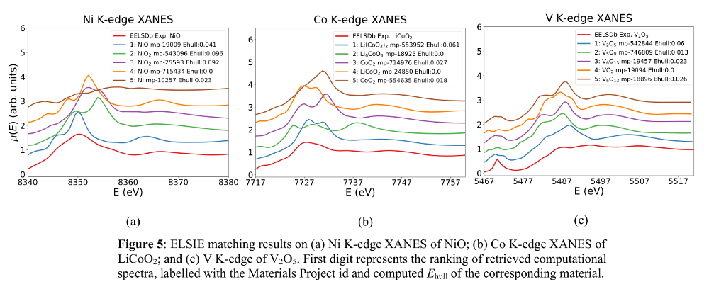
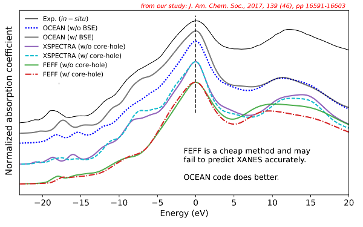

# t4iss
Implementation of some theoretical methods for ISS at NSLS-II.

    # Assuming you have python 3.6+ environment through anaconda 
    $ conda install --channel matsci pymatgen
    $ conda install -c omnia pybtex 
    $ cd data; unzip XANES.zip; cd ..
    $ jupyter notebook &

You need to know your Materials Project API key to run these.

 

You should also be familiar with Materials Project ID of a structure.


## module-1
This module gets structure from Materials Project based on mpid and generates 
a plot of coordination number around central atom and x-ray absorption spectrum
for each non-equivalent atomic sites.

```python
get_XANES(mpr,mpid='mp-5229',absorbing_atom='Ti',export_figure=True)
```

will generate this plot for Ti-K edge of SrTiO3 (mp-5229):


If you want O-K edge, change Ti as O:

```python
get_XANES(mpr,mpid='mp-5229',absorbing_atom='O',export_figure=True)
```

You can also search in MP database like this:
    
```python
# search in MP
mpid_list = search_MP(mpr,search_pattern='Li-Ti-O',nmax=20)

# plot first 5
for s in mpid_list[0:5]:
    get_XANES(mpr,mpid=s,absorbing_atom='Ti')
```

This will search for string "Li-Ti-O" in MP and retrive ids of structures 
less than 20 atoms in unit-cell. First 5 structures will be plotted. * is
also supported. For example, "*-Ti-O" will find 816 structures. But don't
try to plot them....


If you want to compare two structures in the same plot, you can
use compare_two function. mpid1 and mpid2 are ids of two structures.

```python
compare_two(mpid1='mvc-11115',mpid2='mvc-4715',absorbing_atom='Ti')
``` 
will generate this:
    



Suppose you have an experimental unknown spectrum and you want to 
compare it with a spectrum in the database. For this task, you can use
compare_my_unknown function as below. First you should place your unknown
spectrum into "unknowns" folder as two-column plain text and give it a
filename like: unknown.txt. You should also provide mpid of reference.
In the generated plot, you can use x-shift widget for alignment. 
    
```python
compare_my_unknown(fname='unknown.txt',mpid='mvc-11115',absorbing_atom='Ti')
``` 
will generate this:
    



TODOs:
- [x] Add support for Windows and MacOS.
- [ ] Better exception handling.
- [ ] Improve documentation.
- [ ] many more.....


## module-2
will be for implementing MCR-ALS [https://mcrals.wordpress.com](https://mcrals.wordpress.com)



## module-3
will be for implementing XASMatcher [https://arxiv.org/abs/1711.02227](https://arxiv.org/abs/1711.02227)



## module-4
will be on Machine Learning methods such as implementing this work:
- Janis Timoshenko, Deyu Lu, Yuewei Lin, Anatoly I. Frenkel, [Supervised Machine-Learning-Based Determination of Three-Dimensional Structure of Metallic Nanoparticles](https://pubs.acs.org/doi/abs/10.1021/acs.jpclett.7b02364), J. Phys. Chem. Lett., 2017, 8 (20), pp 5091–5098.

and/or


## module-5
will be on implementing OCEAN/EXCITING calculations.




## Author
* Mehmet Topsakal (mtopsakal@bnl.gov)
