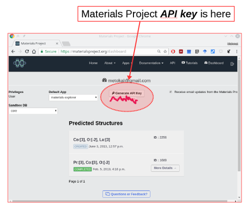
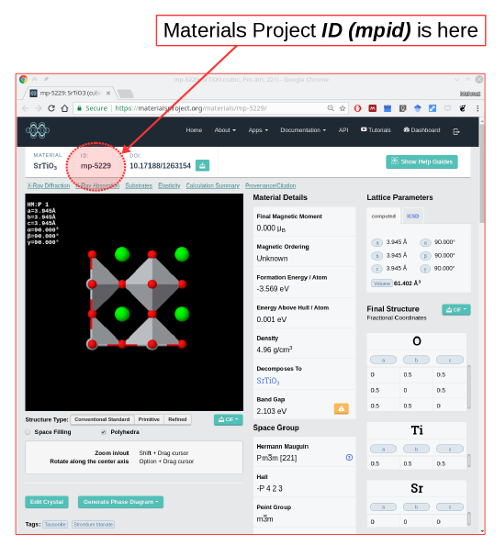
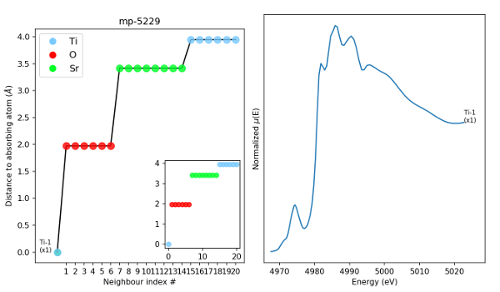

# t4iss
Implementation of some theoretical methods for ISS at NSLS-II.

    # Assuming you have python 3.6+ environment through anaconda 
    $ conda install --channel matsci pymatgen
    $ conda install -c omnia pybtex 
    $ cd data; unzip XANES.zip; cd ..
    $ jupyter notebook &

You need to know your Materials Project API key to run these.

 

You should also be familiar with Materials Project ID of a structure.




## module-1
This module gets structure from Materials Project based on mpid and generates 
a plot of coordination number around central atom and x-ray absorption spectrum
for each non-equivalent atomic sites.

```python
get_XANES(mpr,mpid='mp-5229',absorbing_atom='Ti',export_figure=True)
```

will generate this plot




## Author
* Mehmet Topsakal (mtopsakal@bnl.gov)
